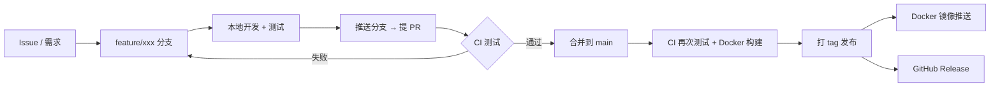
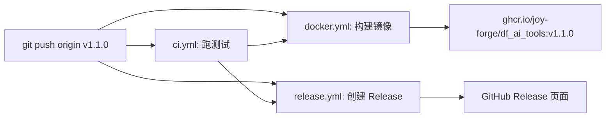
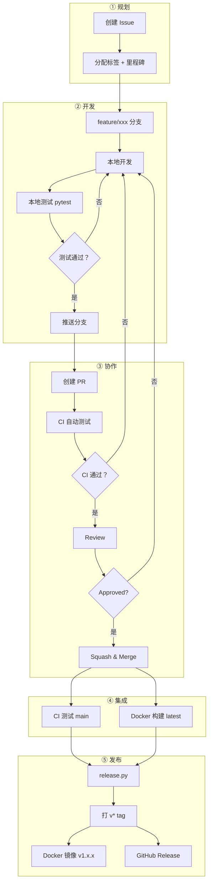

# 开发工作流

从 Issue 到发布上线的完整流程。



---

## 1. Issue — 一切从这里开始

在 GitHub 上创建 Issue 描述需求、Bug 或改进：

- **标题**：简明扼要，如"新增账单分类统计功能"
- **标签**：`enhancement` / `bug` / `feature`
- **内容**：描述做什么、为什么做、验收标准

> 后续 PR 关联 Issue：PR 描述中写 `Closes #12`，合并后 Issue 自动关闭。

---

## 2. 分支开发

### 2.1 拉取新分支

```bash
git checkout main          # 确保基于最新的 main
git pull origin main
git checkout -b feature/xxx   # 或 bugfix/xxx, enhance/xxx
```

**分支命名规范：**

| 前缀 | 用途 |
|------|------|
| `feature/` | 新功能 |
| `bugfix/` | 修 Bug |
| `enhance/` | 优化/重构 |

### 2.2 本地开发

使用 VS Code launch 配置快速启动开发环境：

| 启动配置 | 用途 |
|----------|------|
| 🔧 FastAPI Dev Server (热重载) | 本地运行 API，修改代码自动重启 |
| 🧪 Run All Tests | 运行全部测试 |
| 🐳 Docker: Build & Run | 用 Docker 构建并启动 |

### 2.3 本地测试

```bash
# 运行全部测试并检查覆盖率（要求 ≥ 75%）
python -m pytest tests/ --cov=src --cov-report=term --cov-branch --cov-fail-under=75

# 或 VS Code → 运行 → 🧪 Run All Tests
```

> 如果代码覆盖率低于 75%，CI 会直接报红，不要带着低覆盖率合并。

### 2.4 Commit

```bash
git add .
git commit -m "feat: 新增账单分类统计功能"
```

---

## 3. 提 PR — 自动 CI 测试

### 3.1 推送分支

```bash
git push origin feature/xxx
```

### 3.2 在 GitHub 创建 Pull Request

- **标题**：简短描述变更，建议关联 Issue，如 `feat: 新增账单分类统计 (Closes #12)`
- **描述**：说明做了什么、如何测试、有无破坏性变更

### 3.3 PR 触发 CI

推送后 GitHub 自动运行 **ci.yml**：

- Python 3.10 / 3.11 / 3.12 三个版本并行测试
- 运行全部测试 + 覆盖率检查（≥ 75%）

在 PR 页面可以看到 CI 结果：

- ✅ **绿色** — 测试通过，可以合并
- ❌ **红色** — 测试失败，需修复后重新推送

> 注意：docker.yml 也会在 PR 时触发，构建 Docker 镜像但不推送到注册表。

---

## 4. 合并到 main

### 4.1 合并条件

- [ ] 至少 1 人 Review 通过
- [ ] CI 全部绿色
- [ ] 覆盖率 ≥ 75%

### 4.2 合并方式

在 GitHub PR 页面点击 **Squash and merge**，保持 main 历史整洁。

### 4.3 合并后自动触发

合并到 main 后 GitHub Actions 自动运行：

| 工作流 | 做什么 |
|--------|--------|
| **ci.yml** | 再次跑测试，确保 main 始终健康 |
| **docker.yml** | 构建并推送 Docker 镜像到 `ghcr.io`，标签为 `latest` + `sha-xxxxx` |

---

## 5. 发布 — 打 tag

功能开发完成并合并到 main 后，可以发布正式版本。

### 5.1 运行发布脚本

```bash
# 方式 A：终端运行
python scripts/release.py

# 方式 B：VS Code → 运行 → 🏷️ Release (打标签发布)
```

### 5.2 脚本流程

```
📌 上一个 tag: v0.2.0

输入版本号 (例如 1.0.0，不需要 v 前缀): 1.1.0

========================================
  版本:    v1.1.0
  分支:    main
========================================

确认发布？(y/N): y

🚀 创建 tag v1.1.0 ...
📤 推送 tag 到 origin (GitHub) ...

✅ 发布成功！
   https://github.com/Joy-Forge/df_ai_tools/actions
```

脚本自动完成：
1. ✅ 检查是否在 main 分支
2. ✅ 检查是否有未提交的修改
3. ✅ 显示上一个 tag 供参考
4. ✅ 校验版本号格式
5. ✅ 检查 tag 是否已存在（防止覆盖）
6. ✅ 打标签 → 推送到 GitHub

### 5.3 发布后自动触发

推送 `v*` 标签到 GitHub 后，按以下顺序执行：



### 5.4 发布产物

| 产物 | 位置 |
|------|------|
| Docker 镜像 | `ghcr.io/Joy-Forge/df_ai_tools:v1.1.0` |
| Release 页面 | GitHub 仓库 Releases 页 |
| 自动 changelog | 基于 commit 消息生成 |

---

## 6. 完整流程图



---

## 7. 常见问题

### 发布脚本提示 tag 已存在

```
❌ tag「v1.0.0」已存在，请使用更高的版本号。
```

说明这个版本号已经发过，输入更高的版本号即可（如 `v1.0.1` 或 `v1.1.0`）。

### CI 在 PR 阶段失败了怎么看？

1. 打开 PR 页面，下滑到 **Checks** 区域
2. 点击 **Details** 查看失败日志
3. 本地复现：`python -m pytest tests/ -v --tb=long`

### 合并到 main 后需要立刻修复怎么办？

- **小修**：直接在 main 上提交（少用）
- **标准流程**：从 main 拉 `bugfix/xxx` → 修复 → 提 PR → 合并
